# [Letmeask](https://letmeask-316da.web.app/)

Projeto criado na [NLW] Together, voltado para o gerenciamento de perguntas e respostas. Nesta aplicação é possível a criação de salas individuis (após autenticação com o Google), possuindo um nome e um código único de acesso. Nela é possível que os usuários criem perguntas e deem likes nas mesmas. O admin pode deixar alguma pergunta em highlight, marcar como respondida e excluir perguntas.

## 🚀 Começando

O projeto inteiro foi desenvolvido utilizando o [ReacJS](https://reactjs.org/) e como banco de dados foi utilizado Realtime Database do [Firebase](https://firebase.google.com/).

Mas vamos ao que intereça...

### 📋 Pré-requisitos

Para poder criar salas e enviar perguntas se exige apenas um pré-requisito:

```
Possuir uma conta no Google para autenticação na plataforma.
```

_OBS: Não se faz necessária a autenticação com o Google para visualização das perguntas._

### 🔧 Como usar? (Admin)

Vamos ao passo-a-passo para o admin da sala:

Em primeiro:

```
Deve-se clicar no botão "Crie sua sala com o Google" e fazer login com uma conta Google.
```

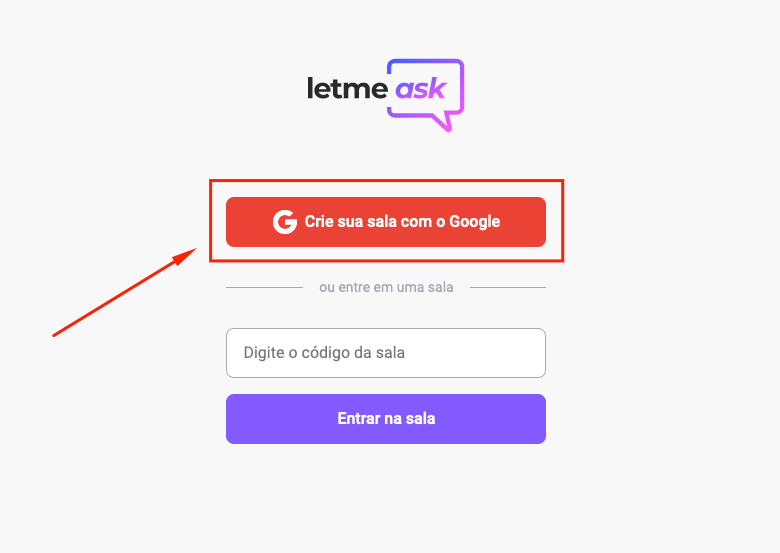

<br><br>
Após realizada a autenticação com a conta Google, é possível dar o nome da sala:

```
Para isso, clique no campo "Nome da sala" e dê um nome de sua preferência.

Após dar o nome a sala, é só clicar em "Criar sala" e você será redirecionado para a sala de administrador.
```

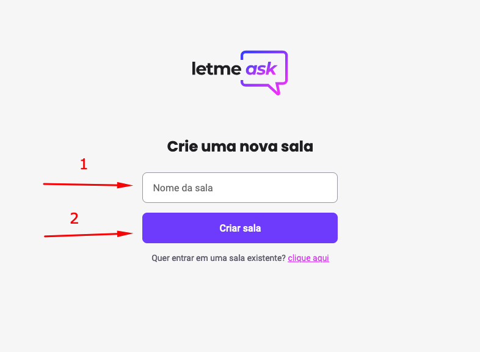
<br>

Nela é possível copiar o código da sala (Localizado no canto superior direito) clicando em cima dele.
O código então, deve ser enviado as pessoas para que possam entrar na sala criada.
<br>

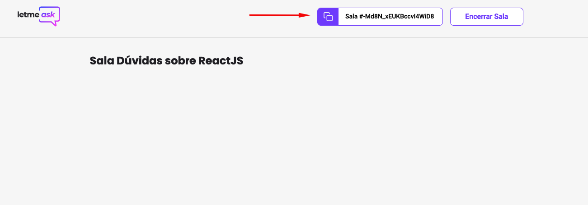
<br><br>

Quando alguém realiza uma pergunta, irão aparece três botões:

```
O primeiro é para responder a pergunta:
```

<br>
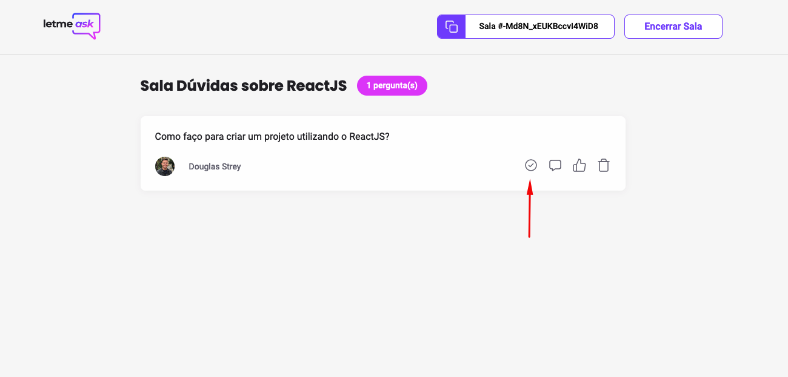
<br>
<br>
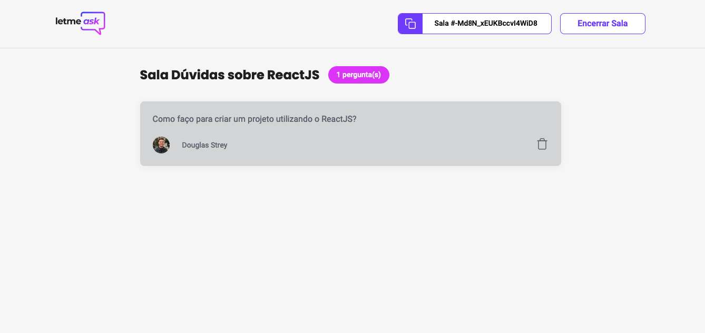
<br>

```
O segundo é para deixar a resposta com destaque:
```

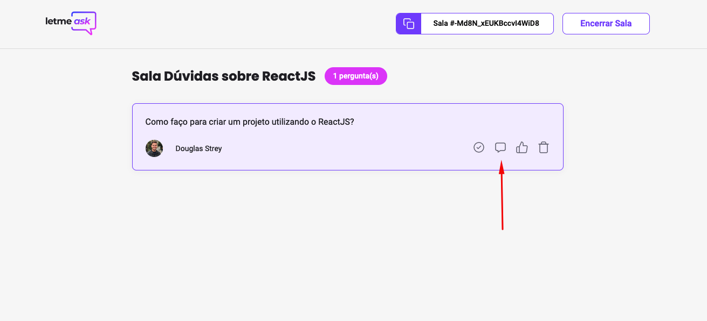
<br>

```
O terceiro é para deixar ver a quantidade de likes que a pergunta tem:
```

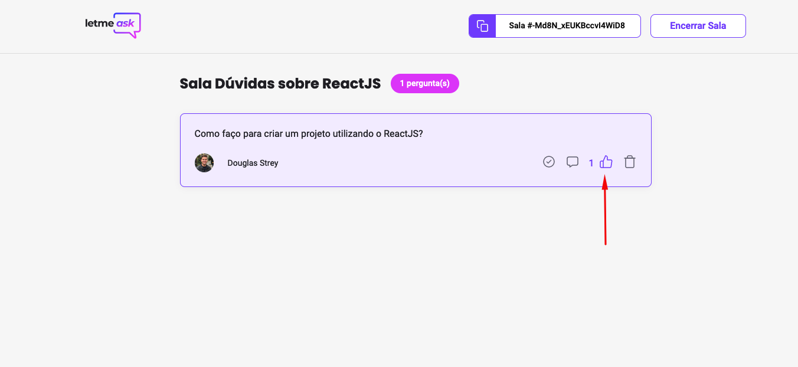
<br>

```
O quarto é para apagar a pergunta:
```

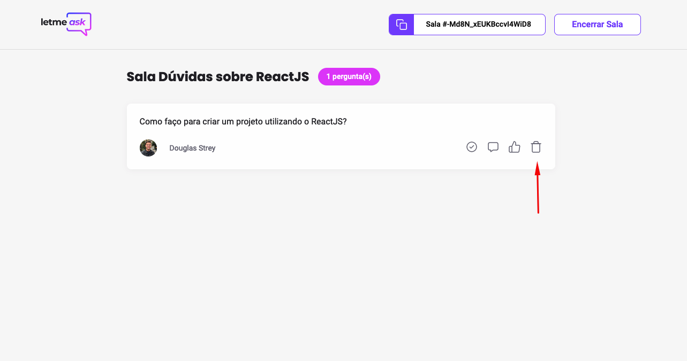
<br><br>

### 🔧 Como usar? (Usuário)

<br>
Em primeiro:

```
Deve-se copiar o código enviado pelo criador da sala e inserir no campo "Digite o código da sala".
```

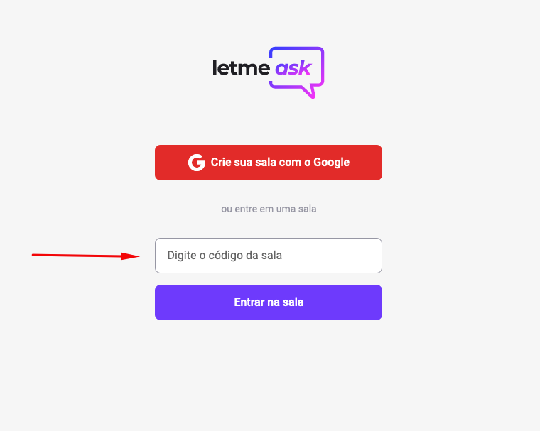
<br><br>

Após isso, clique no botão "Entrar na sala"

<br>
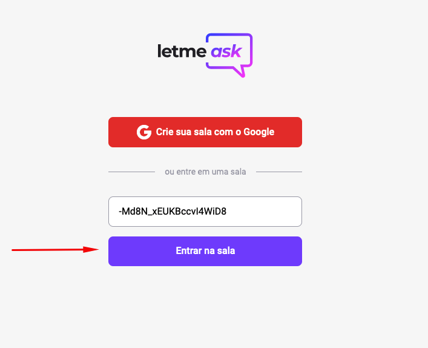
<br>

Dentro da sala, teremos as seguintes opções:

```
No canto superior direito temos o código da sala, que ao clicar em cima poderá ser copiado.
No centro da tela possuimos um campo para que seja digitada a pergunta.
Logo abaixo do campo de pergunta, temos o botão para enviar a mesma, mas tem um porém!
    - O usuário pode ler todas as perguntas que ali forem feitas, mas para poder realizar alguma, precisa estar logado com a conta do Google, para isso, é só clica na frase "faça seu login".
```

<br>
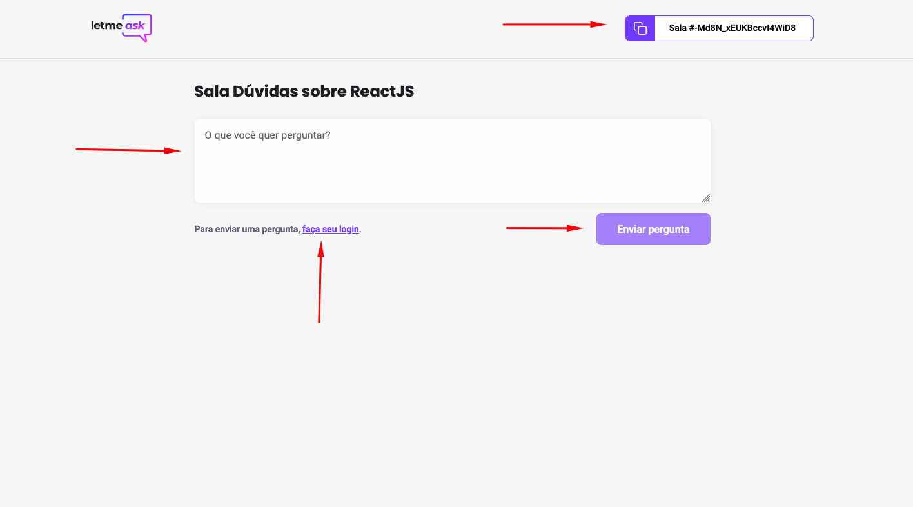
<br>

Ao enviar uma pergunta temos a seguinte tela:

```
Nela temos um botão para dar likes a pergunta, assim, perguntas com mais likes serão mais faceis de serem respondidas.
```

<br>
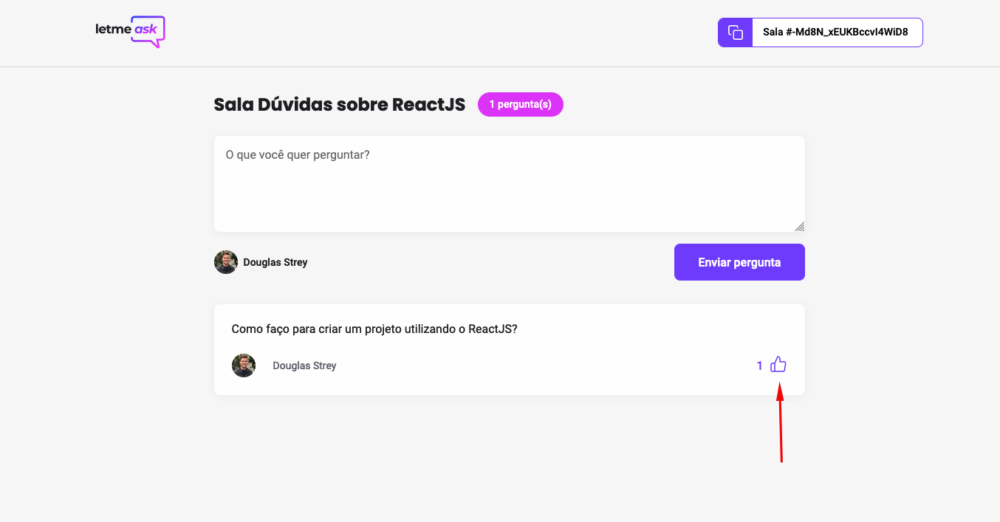
<br>

## 🛠️ Construído com

As ferramentas utilizadas para criar esse projeto foram:

- [ReactJS](https://reactjs.org/) - A biblioteca utilizada.
- [Firebase](https://firebase.google.com/) - O banco de dados utilizado.

## 🖇️ Colaboração

Projeto desenvolvido inteiramente durante o evento da [Rocketseat](https://rocketseat.com.br/) - [NLW] Together.

## ✒️ Autores

Autores do projeto

- **Diego Fernandes** - _Planejamento e ensinamento do projeto_ - [Diego Fernandes](https://github.com/diego3g)
- **Douglas Strey** - _Construção do aplicativo_ - [Douglas Strey](https://github.com/Douglas-Strey)

Você também pode ver a lista de todos os [colaboradores](https://github.com/usuario/projeto/colaboradores) que participaram deste projeto.

## 🎁 Expressões de gratidão

Não tenho palavras para expressar a imensa gratidão que estou sentindo depois de ter finalizado essa [NLW], meu sinceros agradecimentos a [Diego Fernandes](https://github.com/diego3g) por ter dado essas aulas INCRÍVEIS sobre o [ReactJS](https://reactjs.org/) e por ter desenvolvido esse grande projeto que é o [Letmeask](https://letmeask-316da.web.app/)
